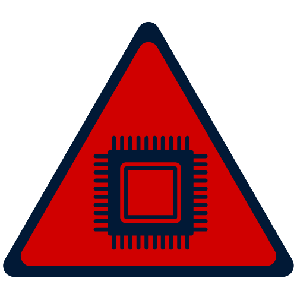

# Olá! Sou o Rafael Menezes 👋

## Tecnologias 👨‍💻

 
    
    
    
    

  

### Projetos 🧠

<a rel="external" target="_blank" 
    href="https://rgmenezes.github.io/portfolio/" 
    style="display: grid; grid-template-columns: 1fr; grid-template-rows: 2fr 1fr;
    gap: 10px; justify-items: center; align-items: cente;"
    > Portfólio</a>

<a rel="external" target="_blank" 
    href="https://rgmenezes.github.io/projetos-completos/" 
    style="display: grid; grid-template-columns: 1fr; grid-template-rows: 2fr 1fr;
    gap: 10px; justify-items: center; align-items: cente;"
    > P. Completos</a>

<a rel="external" target="_blank" 
    href="https://rgmenezes.github.io/estudos/" 
    style="display: grid; grid-template-columns: 1fr; grid-template-rows: 1fr 1fr;
    gap: 10px; justify-items: center; align-items: cente;"
    > Estudos</a>

<a rel="external" target="_blank" 
    href="https://rgmenezes.github.io/teste/" 
    style="display: grid; grid-template-columns: 1fr; grid-template-rows: 2fr 1fr;
    gap: 10px; justify-items: center; align-items: cente;"
    > Testes</a>

